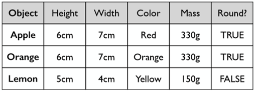
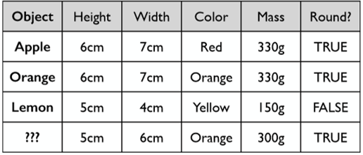

[<<< Previous](02-installation.md) | [Next >>>](04-data.md)

# What Is Classification? 

Let's show an example of classification using fruit!

## Example: Fruit

How would you describe apples to a computer?  How would they differ from oranges?

Remember, computers can only really understand numbers, true false values, and strings within a predefined set.

Source: Andrew Rosenberg

Our fruit test shows us everything we need to do a classification machine learning test. For each item with a *label* (apple, orange, lemon), we use a series of values to try to capture machine-understandable information about the item.  These values are a *feature representation* of the item in question.  The features themselves, as we can see above, can be numeric, true/false values, or a string in a set of predefined strings.

## What if we had a new, unknown fruit?

Source: Andrew Rosenberg

Our fruit test is an example of a *classification* task.  Classification allows you to predict a *categorical* value.  This is a type of *supervised* machine learning, meaning we know the labels ahead of time and can give them to the machine learning algorithm so that it can be trained to knows what the categories of our data are.  This way, when it comes time to give the algorithm previously unseen data, it knows which categories it's looking for.

We acknowledge that often times we are not trying to divide apples and oranges, but categories of people or personal attributes. While we are going to focus on the mechanics of machine learning, we strongly recommend that this work be paired with a grounding in ethics, such as the [DHRI-Ethics](https://github.com/DHRI-Curriculum/ethics) workshop.

[<<< Previous](02-installation.md) | [Next >>>](04-data.md)
