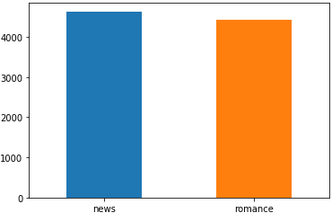

[<<< Previous](03-classification.md) | [Next >>>](05-features.md)

# Getting Our Data

Let's get to coding!

We are going to _classify_ two different sets of sentences from very different source material in the Brown corpus: one set of sentences from a corpus of news text, and the other set of sentences from a corpus of romance novel text.

```python
from nltk.corpus import brown
```

First, we want to take a look at each of the categories in the Brown corpus, so let's run the following code:

```python
for cat in brown.categories():
    print (cat)
```

It should generate a list of categories looking like this:

```
adventure
belles_lettres
editorial
fiction
government
hobbies
humor
learned
lore
mystery
news
religion
reviews
romance
science_fiction
```

Next, let's create two lists containing the sentences for two different categories—`news` and `romance`. In order to do so, run the following script:

```python
news_sent = brown.sents(categories=["news"])
romance_sent = brown.sents(categories=["romance"])
```

To make sure that the lists were set up correctly, we can take a look at the first 5 sentences in each corpus by running the following code:

```python
print (news_sent[:5])
print ()
print (romance_sent[:5])
```

It should output two long lists (containing nested lists) for us, like this:

```python
[['The', 'Fulton', 'County', 'Grand', 'Jury', 'said', 'Friday', 'an', 'investigation', 'of', "Atlanta's", 'recent', 'primary', 'election', 'produced', '``', 'no', 'evidence', "''", 'that', 'any', 'irregularities', 'took', 'place', '.'], ['The', 'jury', 'further', 'said', 'in', 'term-end', 'presentments', 'that', 'the', 'City', 'Executive', 'Committee', ',', 'which', 'had', 'over-all', 'charge', 'of', 'the', 'election', ',', '``', 'deserves', 'the', 'praise', 'and', 'thanks', 'of', 'the', 'City', 'of', 'Atlanta', "''", 'for', 'the', 'manner', 'in', 'which', 'the', 'election', 'was', 'conducted', '.'], ['The', 'September-October', 'term', 'jury', 'had', 'been', 'charged', 'by', 'Fulton', 'Superior', 'Court', 'Judge', 'Durwood', 'Pye', 'to', 'investigate', 'reports', 'of', 'possible', '``', 'irregularities', "''", 'in', 'the', 'hard-fought', 'primary', 'which', 'was', 'won', 'by', 'Mayor-nominate', 'Ivan', 'Allen', 'Jr.', '.'], ['``', 'Only', 'a', 'relative', 'handful', 'of', 'such', 'reports', 'was', 'received', "''", ',', 'the', 'jury', 'said', ',', '``', 'considering', 'the', 'widespread', 'interest', 'in', 'the', 'election', ',', 'the', 'number', 'of', 'voters', 'and', 'the', 'size', 'of', 'this', 'city', "''", '.'], ['The', 'jury', 'said', 'it', 'did', 'find', 'that', 'many', 'of', "Georgia's", 'registration', 'and', 'election', 'laws', '``', 'are', 'outmoded', 'or', 'inadequate', 'and', 'often', 'ambiguous', "''", '.']]

[['They', 'neither', 'liked', 'nor', 'disliked', 'the', 'Old', 'Man', '.'], ['To', 'them', 'he', 'could', 'have', 'been', 'the', 'broken', 'bell', 'in', 'the', 'church', 'tower', 'which', 'rang', 'before', 'and', 'after', 'Mass', ',', 'and', 'at', 'noon', ',', 'and', 'at', 'six', 'each', 'evening', '--', 'its', 'tone', ',', 'repetitive', ',', 'monotonous', ',', 'never', 'breaking', 'the', 'boredom', 'of', 'the', 'streets', '.'], ['The', 'Old', 'Man', 'was', 'unimportant', '.'], ['Yet', 'if', 'he', 'were', 'not', 'there', ',', 'they', 'would', 'have', 'missed', 'him', ',', 'as', 'they', 'would', 'have', 'missed', 'the', 'sounds', 'of', 'bees', 'buzzing', 'against', 'the', 'screen', 'door', 'in', 'early', 'June', ';', ';'], ['or', 'the', 'smell', 'of', 'thick', 'tomato', 'paste', '--', 'the', 'ripe', 'smell', 'that', 'was', 'both', 'sweet', 'and', 'sour', '--', 'rising', 'up', 'from', 'aluminum', 'trays', 'wrapped', 'in', 'fly-dotted', 'cheesecloth', '.']]
```

## Organization of Data

What do you notice about the format of the data above?

Each sentence is already _tokenized_—split into a series of word and punctuation strings, with whitespace removed. This saves us the time of having to do all of this work ourselves!

To start to organize our data, let's put these sentences into a `pandas` _DataFrame_, an object which has a format very similar to an Excel spreadsheet. We will first make two spread sheets (one for news, and one for romance), and then combine them into one. We will also add the category each sentences came from, which will be our _labels_ for each sentence and its associated feature representation (which we will build ourselves).

```python
ndf = pd.DataFrame({'sentence': news_sent,
                    'label':'news'})
rdf = pd.DataFrame({'sentence':romance_sent,
                    'label':'romance'})
```

Next, we combine the two DataFrames into one by running:

```python
df = pd.concat([ndf, rdf])
```

Let's see what this DataFrame looks like!

```python
df.head()
```

The DataFrame's built-in method `head` will generate a table of the first five rows of the DataFrame:

|       | label  | sentence
| ---   | ---    | ---
| **0** | news   | [The, Fulton, County, Grand, Jury, said, Frida...
| **1** | news   | [The, jury, further, said, in, term-end, prese...
| **2** | news   | [The, September-October, term, jury, had, been...
| **3** | news   | [``, Only, a, relative, handful, of, such, rep...
| **4** | news   | [The, jury, said, it, did, find, that, many, o...

Next, let's see how many labels we have by using the DataFrame column's `value_count` method:

```python
df['label'].value_counts()
```

This should generate a list looking like:

```
news       4623
romance    4431
Name: label, dtype: int64
```

## Visualizing the Categories

What if we wanted to visualize the information we have about our categories?

We first create a `figure` and `axes` on which to draw our charts using `plt.subplots()`. Each chart is one axes, and a figure can contain multiple axes. This notation is explained in detail in the ["Visualization" appendix](a01-visualize.md). Our data is encapsulated in `df['label'].value_counts()`, which is itself a DataFrame. We then tell the `pandas` to visualize the DataFrame as a bar chart using `.plot.bar(ax=ax, rot=0)`. The `ax` keyword tells `pandas` which chart in the figure to plot, and the `rot` keyword controls the rotation of the x axis labels.

```python
fig, ax = plt.subplots()
_ = df['label'].value_counts().plot.bar(ax=ax, rot=0)
fig.savefig("categories_counts.png", bbox_inches = 'tight', pad_inches = 0)
```



From the graph it is easy to see that we have slightly more news data than romance data, which we should keep in mind as we go ahead with classification.

[<<< Previous](03-classification.md) | [Next >>>](05-features.md)
