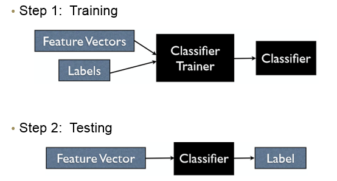
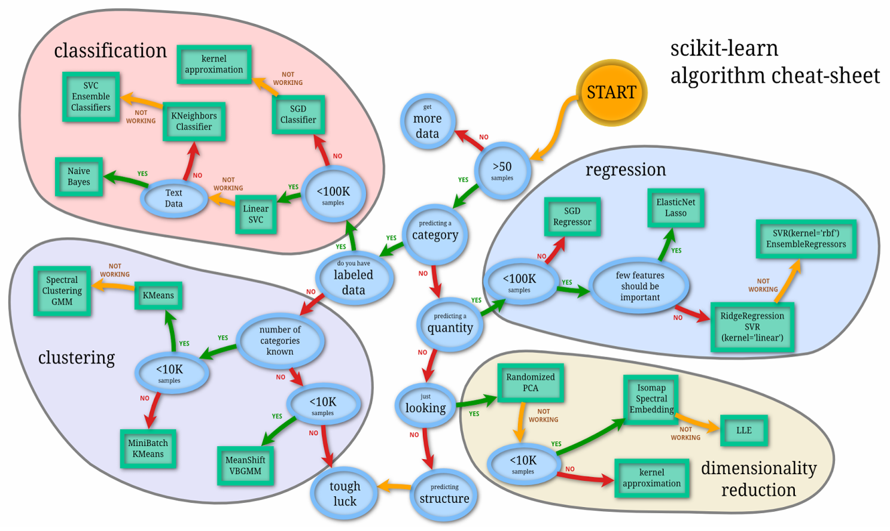
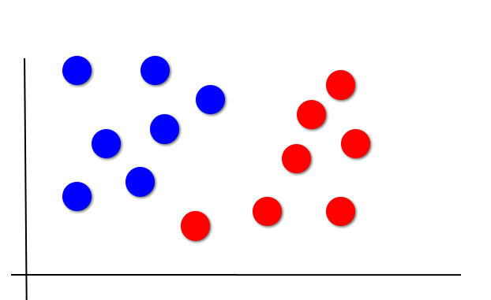

[<<< Previous](05-features.md) | [Next >>>](07-supervised_classification.md)

# Supervised Machine Learning

Supervised machine learning takes places in two steps: the _training_ phase, and the _testing_ phase. This image from Andrew Rosenberg helps explain the process:



In the **training phase**, you use a portion of your data to _train_ your algorithm (which, in our case, is a classification algorithm). You provide both your feature vector and your labels to the algorithm, and the algorithm searches for patterns in your data that can help associate it with a particular label.

In the **testing phase**, we use the classifier we trained in the previous step, and give it previously unseen feature vectors representing unseen data to the algorithm, and have the algorithm predict the label. We can then compare the "true" label to the predicted label, and see if our classifier provides us with a good and generalizable way of accomplishing the task (in our case, the task of automatically distinguishing news sentences from romance sentences).

It's important to remember that we cannot use the same data we used to build the classifier to test the data; if we did, our classifier would be 100% correct all of the time! This will not tell us how our trained classifer will perform on new, unseen data. We therefore need to split our data into a _train set_ and a _test set_.

- We will use the train set data to train our classifier
- We will use the test set data to test our classifier

Make sure you have loaded the Python libraries needed for the analysis, from the [Installation and Setup](02-installation.md) (`nltk`, `pandas`, `sklearn`, etc.).

## Read data in from a spreadsheet

Let's take the data we just saved out and load it back into a DataFrame so that we can do some analysis with it!

```python
df = pd.read_csv("df_news_romance.csv")
```

## Preparing data for machine learning

We're almost ready to do some machine learning!

First, we need to split our data into _feature vectors_ and _labels_. We need them separated to train the classifier. Remember, the features we are using to train our classifier are numbers of nouns, adjectives, and adverbs are in each sentence. (We are not using the sentences themselves as features!)

```python
fv = df[["NN", "JJ"]]
fv.head()
```

We should see a table with the first couple of rows as a result:

|       | NN  | JJ
| ---   | --- | ---
| **0** | 11  | 2
| **1** | 13  | 2
| **2** | 16  | 2
| **3** | 9   | 3
| **4** | 5   | 3

If we want to count the occurrences of each of the labels, we can run:

```python
df['label'].value_counts()
```

This should yield the following output:

```
news       4623
romance    4431
Name: label, dtype: int64
```

We have more sentences labeled `news` than `romance`; this is not a problem, but it's something to take note of during evaluation.

## Partitioning data into train and test sets

When you are partitioning your data into train and test sets, a good place to start is to use 75% of your data for training, and 25% of your data for testing. We want as much training data as possible, while also having enough testing data to ensure that our trained classifier is generalizable across a number of examples. This will also lead to more accurate evalutation of our trained classifier.

Fortunately, `sklearn` has a function that will do exactly this!

```python
from sklearn.model_selection import train_test_split
X_train, X_test, y_train, y_test = train_test_split(fv, df['label'],
                                                stratify=df['label'],
                                                test_size=0.25,
                                                   random_state = 42)
```

We use the `stratify` argument because we have an uneven amount of training data; we have more news sentances than romance sentences. By using `stratify`, we ensure that our classifier will take this data imbalence into account.

In this example, we are using a fixed random state, to ensure we will always get exactly the same value when we classify. Adding this argument is unnecessary for most types of classification; we do it here to ensure our results do not vary slightly across runs.

```python
print(X_train.shape)
print(X_test.shape)
```

The output from the above code should be:

```
(6790, 3)
(2264, 3)
```

## What classifier do I use?

Chosing a classifier can be a challenging task. However, this flowchart can give you an idea of where to start!



Following this flowchart, borrowed from Andreas Mueller, we are going to use `LinearSVC`, which is a linear model for classification that separates classes using a line, a plane, or a hyperplane. SVC stands for "Support Vector Classifier", which is a type of support vector machine algorithm.

## An animated example of classification

The following animated image, borrowed from Andrew Rosenberg, helps us understand how linear classification works. The decision boundaries change based on the distance of the grey dot to the clusters of red and blue dots:



[<<< Previous](05-visualize.md) | [Next >>>](07-supervised_classification.md)
