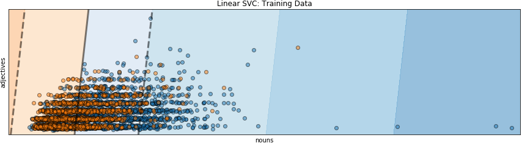
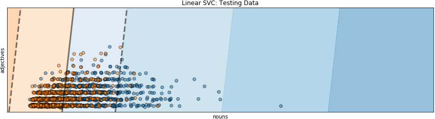

[<<< Previous](06-supervised.md) | [Next >>>](08-unsupervised.md)

# Supervised Classification Algorithm with `sklearn`

One of the best things about `sklearn` is the simplicity of its syntax.

To do machine learning with `sklearn`, follow these three steps (the function names remain the same, regardless of the classifier you use!):

## Step 1: Import your desired classifier

You can choose different classifiers and their differences can be complex to understand so we won't address them in this module. You can look at [the scikit-learn's website](https://scikit-learn.org/stable/auto_examples/classification/plot_classifier_comparison.html) for more information.

In this module, we will use `LinearSVC`, a linear model for classification. We start be importing it:

```python
from sklearn.svm import LinearSVC
```

## Step 2: Create an instance of your machine learning algorithm

An `sklearn` algorithm is an object, which means that we have to create an individual instance of the object as a starting point. We do that by calling the classifier like we would a function:

```python
classifier = LinearSVC()
```

Now, we have an individual instance of the classifier where we can store and train our data, and see the results of the algorithm based on our dataset.

## Step 3: Fit your data to your classifier (train)

`LinearSVC` is a linear model for classification that separates classes using a line, a plane, or a hyperplane.

The `classifier.fit` method searches for that line, plane, or hyperplane-which is also called the decision boundary. The dark gray line in the figure below is the decision boundary that the `LinearSVC` classifier found for this set of training data. All the data (dots) to the left of the gray line in the area with the orange background are classified as romance, while all the data to the right in the blue area are classified as news. The leftward skew of the classification space is due to the data being very dense and highly overlapping. The creation of this visualization is discussed in the ["Visualizing the Decision Boundary" appendix](a02-decision_boundary.md).



To fit your data to your classifier, you run the following Python code:

```python
classifier.fit(X_train, y_train)
```

It should generate the following output:

```
LinearSVC(C=1.0, class_weight=None, dual=True, fit_intercept=True,
        intercept_scaling=1, loss='squared_hinge', max_iter=1000,
        multi_class='ovr', penalty='l2', random_state=None, tol=0.0001,
        verbose=0)
```

## Step 4: Predict labels for unseen data (test)

Now it is time to predict the labels for the data that the model has not yet seen, based on our test set.

We run the prediction on our test set `X_test` (that we partioned off in [the earlier section](06-supervised.md)) using the classifier instance's method `predict`:

```python
y_predict = classifier.predict(X_test)
```

In `LinearSVC`, the `classifier.predict` decides which class a data point is in based on which side of the decision boundary, which is the gray line in the figure, the point falls on.

**Points in the orange area** to the left of the gray line are classified as romance, while **points in the blue area** to the right of the gray line. **Orange points in the blue area** are romance texts that are misclassified as news texts, while **blue points in the orange area** are news texts that are misclassified as romance texts.



## Step 5: Evaluate the model

Now it is time to see how our classifier is holding up. Can it correctly predict previously unseen data?

We evaluate the skill of our model by computing the

- _score_: shows how many predicted labels are the same as the actual labels (expressed as a percentage)
- _confusion matrix_: shows how many times we are predicting categories correctly (expressed as a table consisting of counts of true positives, false positives, false negatives, and true negatives)

### Score

In order to compute the score, we can use the classifier's built-in method `score`:

```python
classifier.score(X_test, y_test)
```

This should yield a percentage:

```
0.70759717314487636
```

This result means that right now, our classifier can correctly predict previously unseen news and data about 70.7% of the time.

### Confusion Matrix

We can get more information about how we are doing by creating a _confusion matrix_. This confusion matrix shows how many times we are predicting categories correctly.

First we need to import the function `confusion_matrix` from `sklearn`'s `metrics` module, and then we can run it on our test set `y_test` (that we created [previously](06-supervised.md)) and the predicted labels `y_predict`:

```python
from sklearn.metrics import confusion_matrix

confusion_matrix(y_test, y_predict)
confusion_matrix
```

The result should be a _confusion matrix_:

|                   | actual news | actual romance
| :--:              | :--:        | :--:
| predicted news    | 747         | 409
| predicted romance | 253         | 855

[<<< Previous](06-supervised.md) | [Next >>>](08-unsupervised.md)
